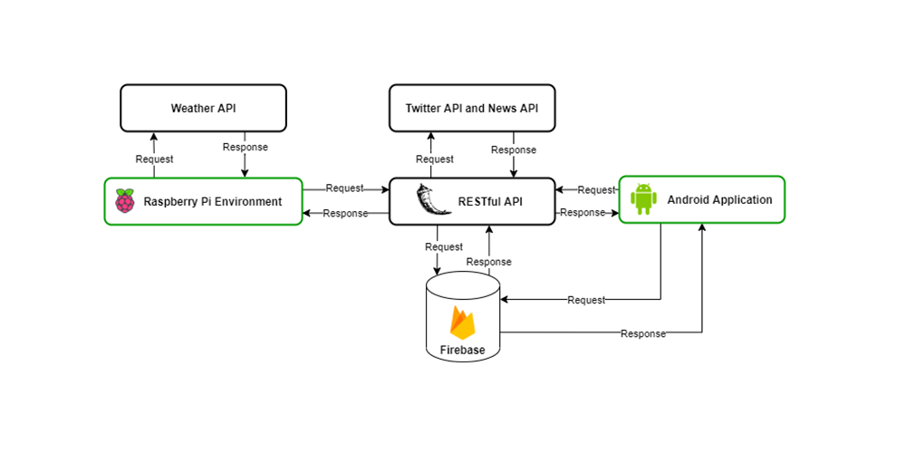

# Problem
In the modern world, where individuals give significant attention to
quality of life, the question arises on whether information can be delivered to users through
everyday household items based on who is using it.

With the development of technology, a new generation of mirrors that display simple information such as time or date to the user are becoming available, but such an interface can be modified further to deliver personalized information based on the user. In addition, content can be structured to fit the user’s emotion in the hopes of enhancing emotional wellbeing.

 

# Solution
The system consists of 4 main components, the Raspberry Pi environment, Android
application, Firebase database and Flask RESTful API. Additionally, the system
integrates with external RESTful APIs. A service-oriented architecture is followed.
The SmartMirror interface would be managed by the Raspberry Pi, while the bulk of
processing would occur in the Flask RESTful API. The face identification and FER CNN
models would exist in this remote environment.

During the development/evaluation cycle, it was observed that identifying user emotion and
getting articles accordingly should be done in real time as user emotions can change rapidly.
Therefore, in Raspberry Pi devices with higher system requirements, FER would be
performed within the system. This would ensure real time emotion detection.

Faces detected from the Raspberry Pi are sent to the REST API for identification. News and various twitter feeds depending on user and current user emotion
are aggregated with the RESTful API.

The android application also communicates with the REST API to setup facial
recognition, update user interests, etc.
User authentications is done by utilizing Firebase Authentication services. This ensures maximum security in the system.

  

# Related repositories

- SmartMirror RaspberryPi interface repository - https://github.com/cmdrGuyson/smart-mirror-interface
  
- SmartMirror mobile repository- https://github.com/cmdrGuyson/smart-mirror-mobile

- SmartMirror RESTful API respository - `Not available publicly`

 

# Convolutional Neural Networks
Two convolutional neural networks were trained as follows

- Facial Identification CNN - Modified VGG-16 network trained to generate 128-dimentional embeddings to be used in face identification.

- Facial Expression Recognition CNN - 23 layer CNN model trained to accurately perform facial expression recognition in embedded devices.

 

# Technologies Used
 

 

 

# Future Enhancements

- Integration with music straming services

- Streamline face recognition process

- Train emotion recognition CNN to identify additional emotions
